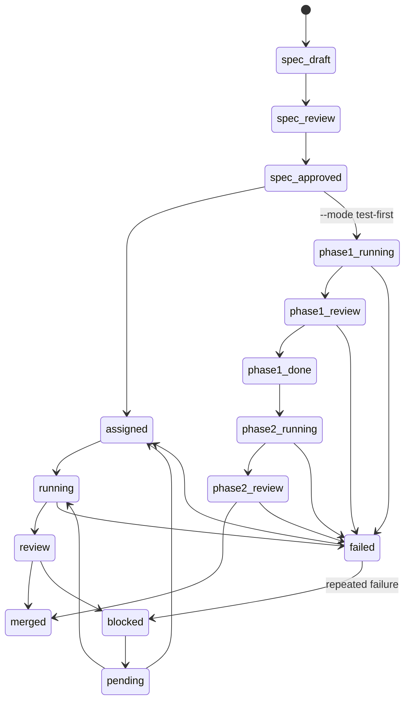

# Orchestration state machine

```mermaid
stateDiagram-v2
    [*] --> spec_draft
    spec_draft --> spec_review
    spec_review --> spec_approved

    spec_approved --> assigned
    assigned --> running
    running --> review
    review --> merged

    pending --> assigned
    pending --> running
    failed --> assigned
    blocked --> pending

    spec_approved --> phase1_running: --mode test-first
    phase1_running --> phase1_review
    phase1_review --> phase1_done
    phase1_done --> phase2_running
    phase2_running --> phase2_review
    phase2_review --> merged

    phase1_running --> failed
    phase1_review --> failed
    phase2_running --> failed
    phase2_review --> failed

    running --> failed
    review --> blocked
    failed --> blocked: repeated failure
```

The legacy route is preserved. Test-first states are optional and only used when dispatch mode is `test-first`.
